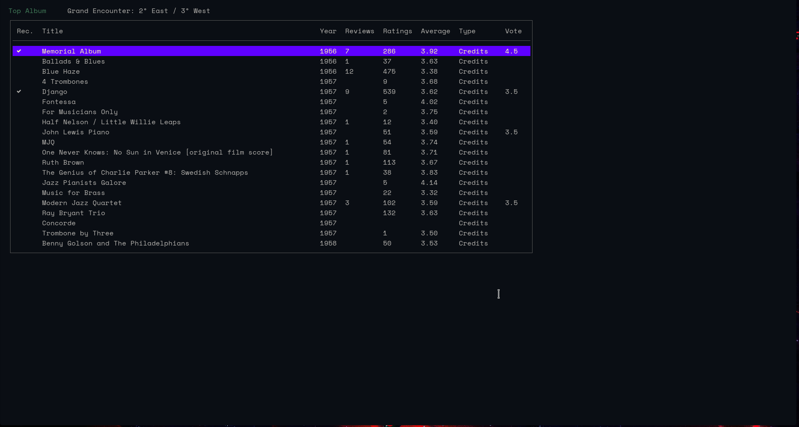
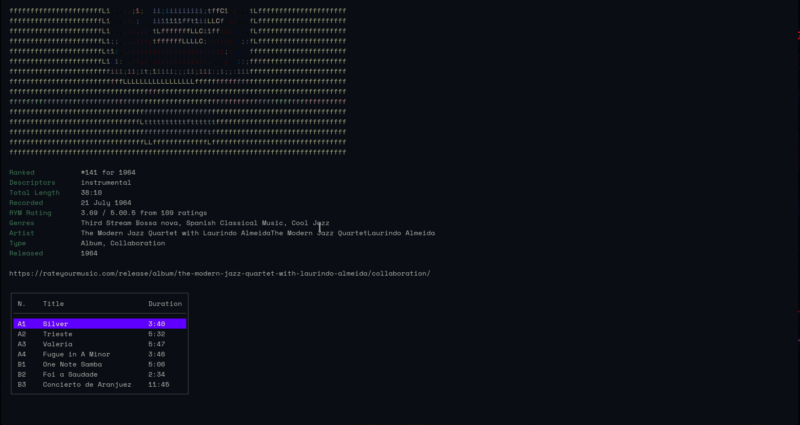

# musicScraper

CLI tool for scraping information from musical website (Rateyourmusic, Metal
Archives), with nice album ASCII art.

## Features

- Search for your favorite artists on Metallum and RateYourMusic (so far)

- Show discography and album tracklist

- Show album credits

- Show user reviews.

- **New RYM feature:** Login and rate an album.

## Usage

Clone the repo and build the package with `go build`, with Go version >= 1.18. Put the binary file in `~/.local/bin`.


Optionally, create a `config.json` file in `~/.config/musicScraper` and write:

```json 
{
    "request_delay": 1,
    "authenticate": true,
    "save_cookies": true
}
```

- `request_delay` allows you to slow down the web scraper, by setting the random
  delay interval (in seconds) between calls. It is highly recommended to set it
  between 1 and 5, since RateYourMusic may block your IP address if the calls are
  too fast. However, you can set it at 0 to disable it.

- `autheticate` at `true` will make the app ask you for RYM username and password,
  you will be able to see and set your album ratings.

- `save_cookies` will save a copy of your RYM cookies in the `~/.cache/musicScraper`
  folder. If disabled, the app will always ask for username and password each time
  `authenticate` is `true`.

```shell

musicScraper [OPTIONS] "name_of_artist"

-credits
        Display RYM credits
-website string
        Desired Website ('metallum' or 'rym')
```

## Credits

Made with [Colly](https://github.com/gocolly/colly) and [Bubbletea](https://github.com/charmbracelet/bubbletea).

## Screenshots




